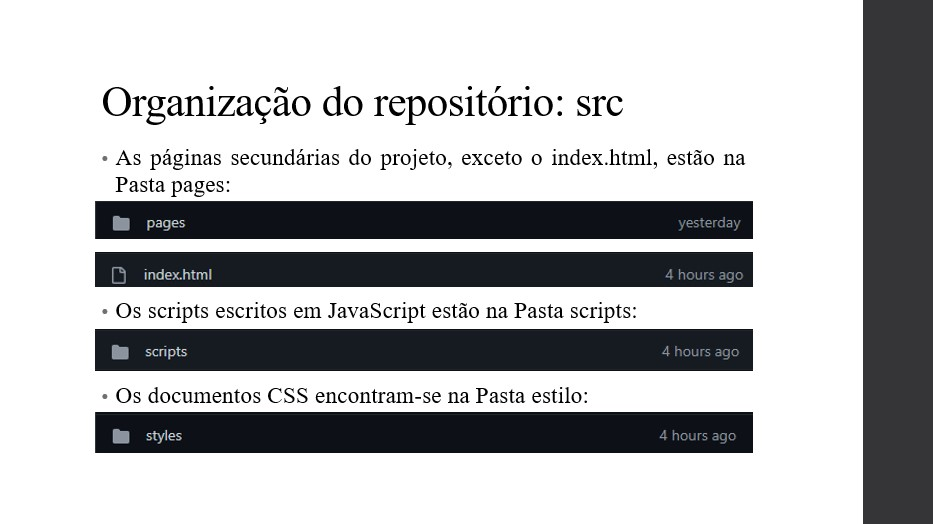
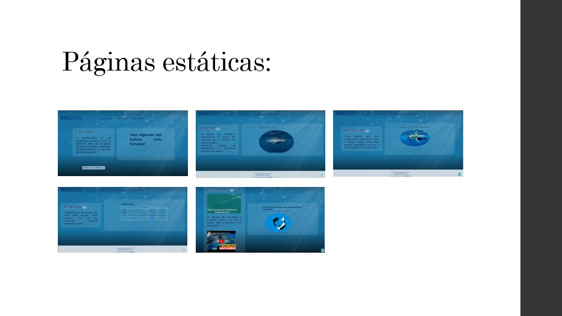
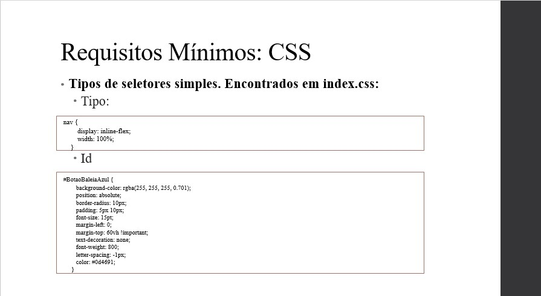

#	Relatório

* O relatório pode ser encontrado [Aqui](../README.md).

# Apresentação

* Foi escolhido a ferramenta Power Point para fazer a apresentação.

| Tópicos      | Imagens |
| ----------- | ----------- |
| Apresentação |  |
| Obejetivo do trabalho |  |
| Tema |  |
| Organização do relatório: Documentos |  | 
| Organização do relatório: src |   |
| Organização do relatório |  |
| Páginas estáticas |  |
| Tecnologias utilizadas |  |
| Páginas |  |
| Interface: Esboço |  |
| Interface: Wireframes para notebook |  |
| Interface: Wireframes para mobile | 
| Interface: Mapa do site |  |
| Requisitos Mínimos |                           |
| Conclusão |  |

# Bibliografia usadas na pesquisa

* Baleia-Azul: 
[Baleia-Azul](https://mundoeducacao.uol.com.br/biologia/baleia-azul.htm)

* Baleia Branca:
[Baleia-Branca](https://pt.wikipedia.org/wiki/Baleia-branca)

* Jubarte:

[Baleia-Jubarte](https://mundoeducacao.uol.com.br/biologia/baleia-azul.htm)

[Baleia-JUbarte](https://pt.wikipedia.org/wiki/Baleia-jubarte)

* Curiosidades sobre as baleias:
[Curiosidades](https://www.youtube.com/watch?v=tmq7Ccd8QuM)

< [Previous](Produto.md) | [^ Main](../README.md) | Next >
:--- | :---: | ---: 
