# Capítulo 2: Interface do usuário

## Descrição

Como já explanado na seção anterior, "Apresentação do projeto", a ideia original era que o projeto fosse dividido nas seguintes páginas, sendo todas estáticas e responsivas:

-  1ª página: Sessão inicial (Menu principal).

-  2ª página: Espécies (Conteúdo geral de algumas das espécies mais conhecidas).
  
-  3ª página: Alimentação (Abordará da caça a forma de alimentação propriamente dita).
  
-  4ª página: Reprodução.
  
-  5ª página: Curiosidades.

 O projeto foi planejado para simular o fundo do oceano e a flutuação dos "objetos" na água. Todas as páginas idealmente seriam interligadas entre si, podendo-se acessar qualquer uma dela através da navegação do topo de todas as páginas. 

## Interface e recursos comuns

# Sketchs: 

* Primeiro Esboço do Projeto para celulares:
  
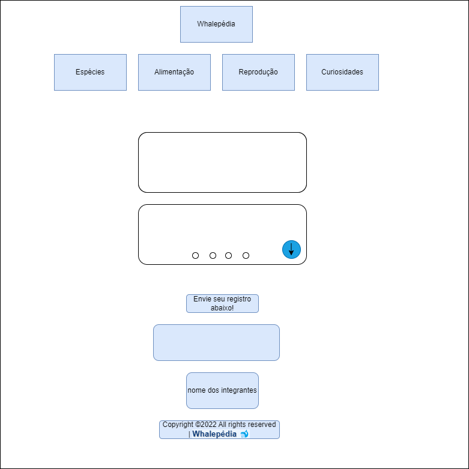

* Primeiro Esboço do Projeto para Desktop/Notebook/entre outros:

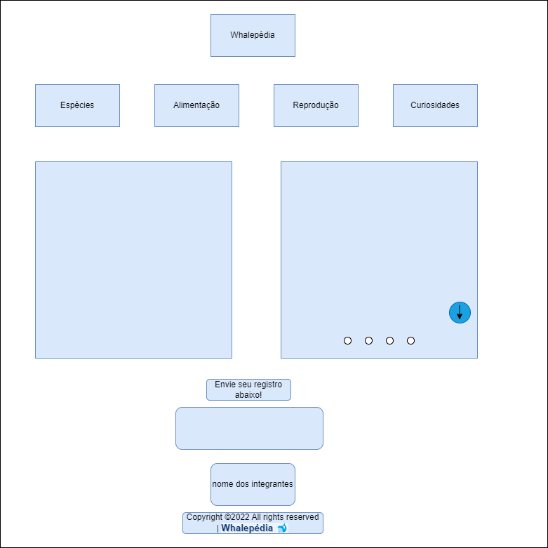

# Wireframes:

| Celular      | Desktop/Notebook/entre outros |
| ----------- | ----------- |
| 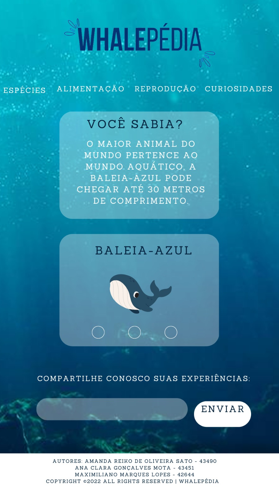      | 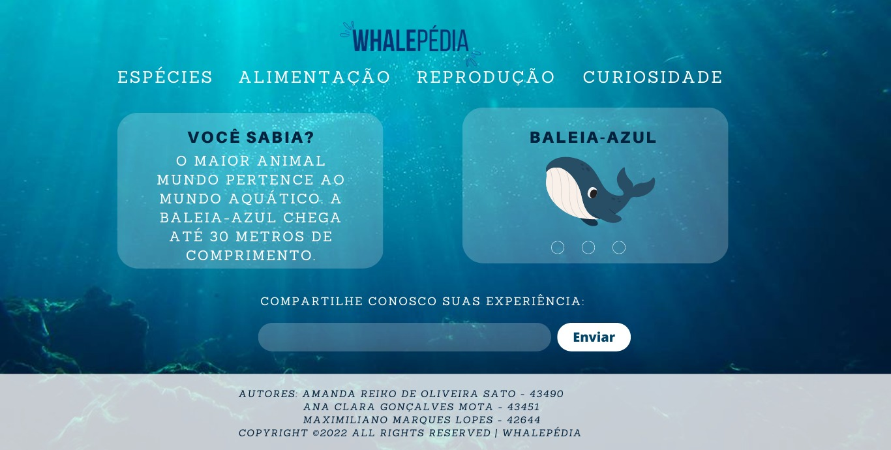       |
| 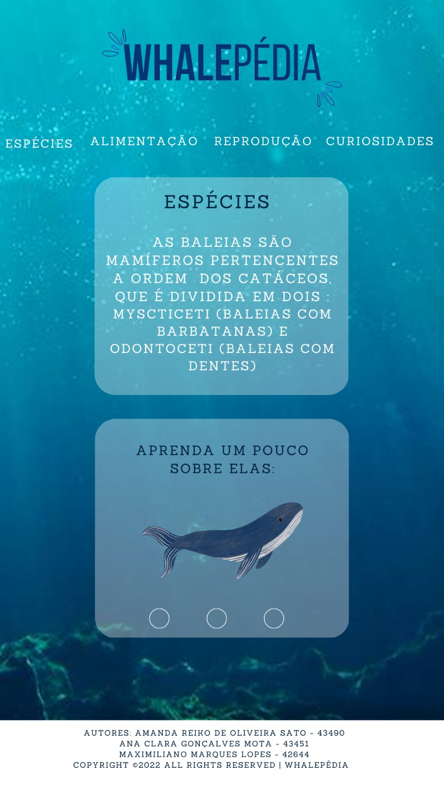   | 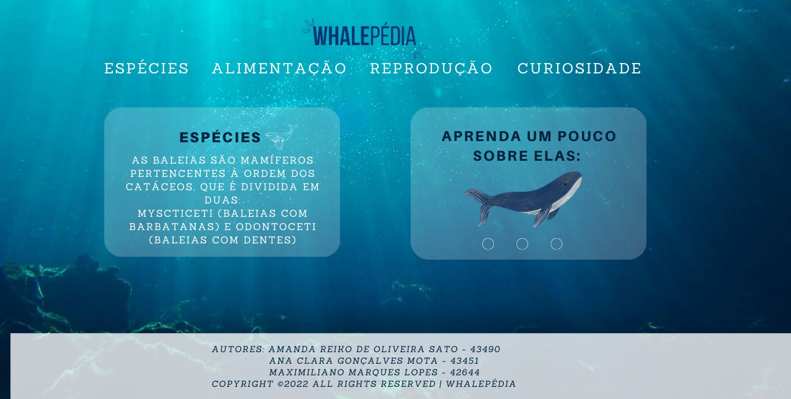        |
| 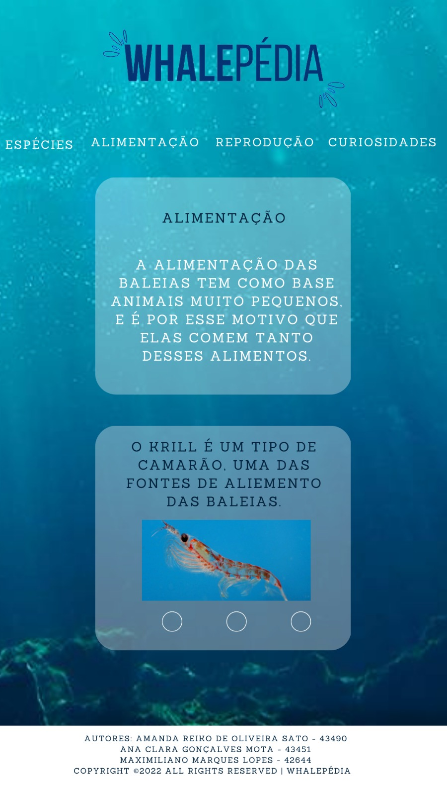   | 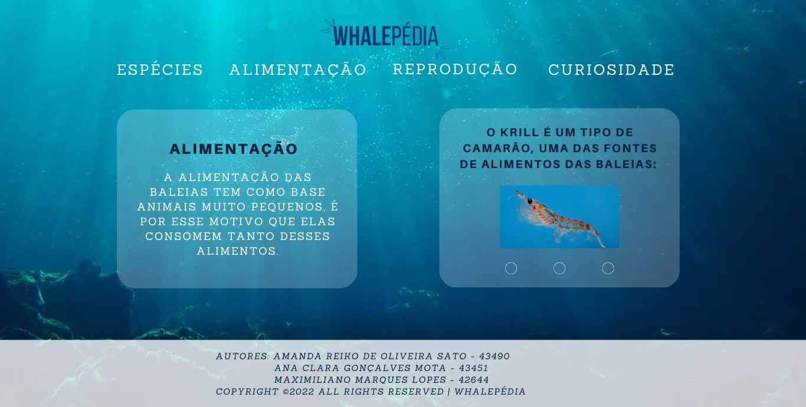        |
| 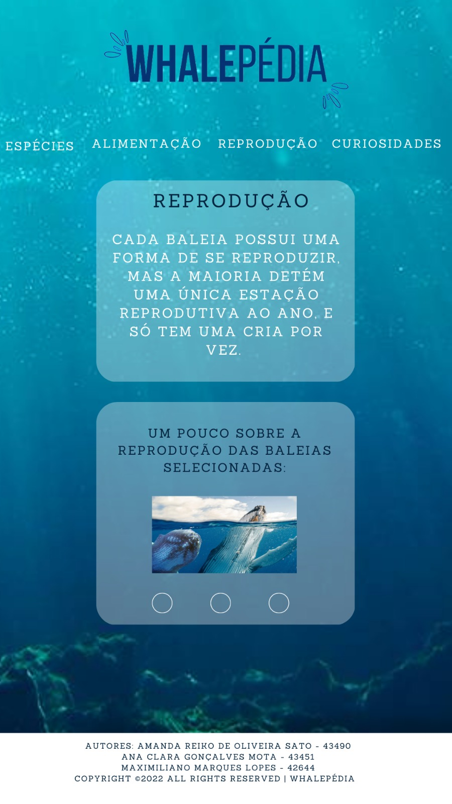   | 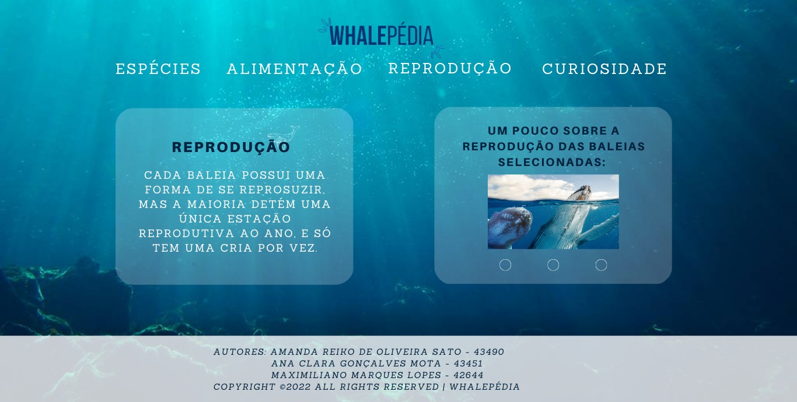        |
| 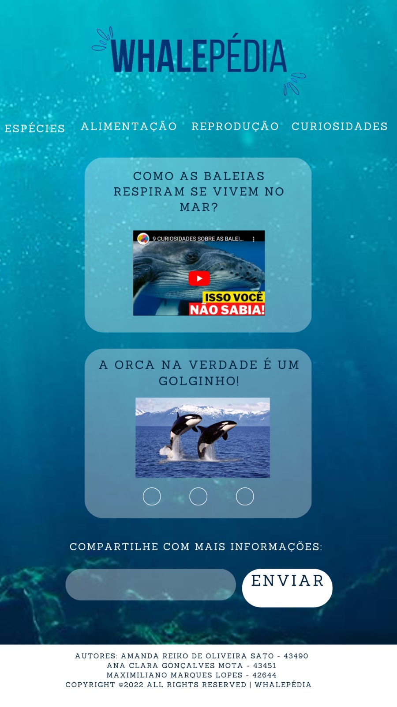   | 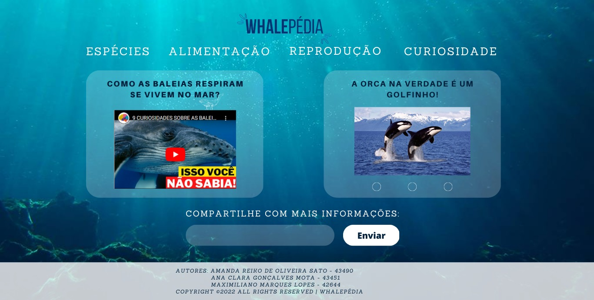        |

---

< [Previous](Apresentação_do_projeto.md) | [^ Main](../README.md) | [Next >](Produto.md)
:--- | :---: | ---: 