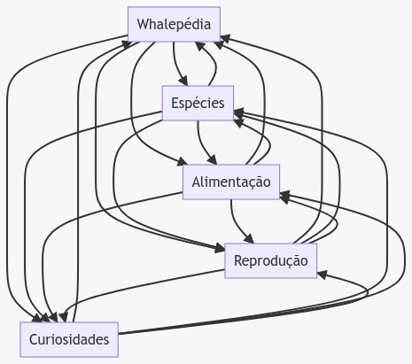
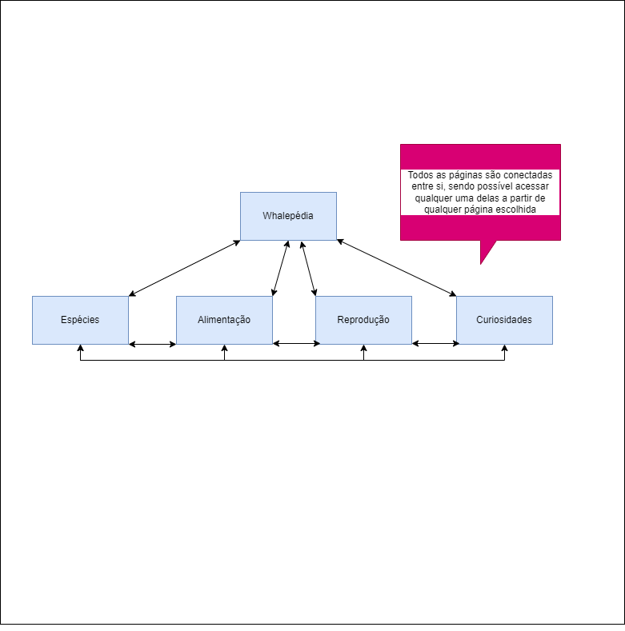

# Capítulo 2: Interface do usuário

## Descrição

Como já explanado na seção anterior, "Apresentação do projeto", a ideia original era que o projeto fosse dividido nas seguintes páginas, sendo todas estáticas e responsivas:

-  1ª página: Sessão inicial (Menu principal).

-  2ª página: Espécies (Conteúdo geral de algumas das espécies mais conhecidas).
  
-  3ª página: Alimentação (Abordará da caça a forma de alimentação propriamente dita).
  
-  4ª página: Reprodução.
  
-  5ª página: Curiosidades.

 O projeto foi planejado para simular o fundo do oceano e a flutuação dos "objetos" na água. Todas as páginas idealmente seriam interligadas entre si, podendo-se acessar qualquer uma dela através da navegação do topo de todas as páginas. 
 
 * A diferença primordial entre a usabilidade por celulares e por Desktop/Notebook/entre outros, está concentrada principalmente na visualização dos links de navegação e nas boxes que compõe o "corpo do texto". 
 * Enquanto nos celulares, os links aparecem um abaixo do outro, a partir do primeiro link da página principal [Whalepédia](../src/index.html), as 2 (duas) boxes que contém o conteúdo relevante do site, são dispostas uma abaixo da outra, sequencialmente, primeiro a boxe sem slides e, depois, a que contém slides. 
 * Na visualização para Desktop/Notebook/entre outros, se dá da seguinte forma: Os links de navegação são dispostos lado a lado, sendo a página principal a primeira da esquerda, e seguindo a sequência especificada acima. As boxes com informação relevante também são postas lado a lado. 

**Observação: A página principal (index.html), é acessada na barra de navegação através da logotipo [Whalepédia](../src/images/LogoImg.png)**

## Interface e recursos comuns

# Sketchs: 

* Primeiro Esboço do Projeto para celulares:
  

* Primeiro Esboço do Projeto para Desktop/Notebook/entre outros:

# Wireframes:

| Página | Celular      | Desktop/Notebook/entre outros |
| ----------- | ----------- | ----------- |
| Página index |       |        |
| Página Espécies |    |         |
| Página Alimentação |    |         |
| Página Reprodução |    |         |
| Página Curiosidades |    |         |

# Sitemap

O projeto foi constituído de forma a ter todas as páginas integradas entre si, onde se pode aceder a qualquer delas através daquela em que se está no momento. A navegagação entre as páginas estão localizadas principalmente na parte inicial das páginas do site. Também há um "botão" nomeado como "Saiba mais sobre ela!" constante na página principal ([index.html](../src/index.html)) que a conecta, em via única, à página [Espécies](../src/pages/especies.html). 

| Sitemap      | Descrição |
| ----------- | ----------- |
|    | Primeiro esboço feito, sendo visualmente mais "caótico" de visualização, mas que demonstra a usabilidade do site.     |
|     | Segundo esboço feito, sendo visualmente mais confortável de ler que a primeira versão e aprimora o entendimento de usabilidade do site. |

---

< [Previous](Apresentação_do_projeto.md) | [^ Main](../README.md) | [Next >](Produto.md)
:--- | :---: | ---: 